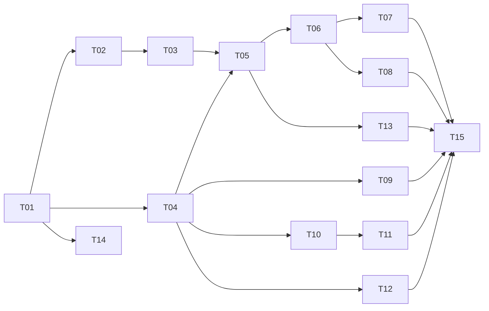

# Roadmap

Work is split into tasks. Each task is sized for one planning session followed by one or a few pull requests. Start a task only after its dependencies are done. Plan it against the listed specs before writing code.

## Status

| Task | Title | Status | PRs |
|---|---|---|---|
| T00 | Design documents | done | #1 |
| T01 | Project skeleton | done | #2 |
| T02 | Journal | done | #3 |
| T03 | Tuner: search and confirmation | done | #4 |
| T04 | Simulator | done | #5 |
| T05 | Run loop and crash resume | done | #6 |
| T06 | Guard | in review | #7 |
| T07 | Tiers, status and certificate | in review | |
| T08 | Regain and reset | todo | |
| T09 | SMU driver and preflight | todo | |
| T10 | Trial runner and containment | todo | |
| T11 | Backends: mprime and y-cruncher | todo | |
| T12 | Kernel evidence: MCE and crash detection | todo | |
| T13 | NixOS module and tuning boot | todo | |
| T14 | CI on Forgejo Actions | todo | |
| T15 | First tuning on the target machine | todo | |

Statuses: `todo`, `in progress`, `in review`, `done`. The pull request that starts or finishes a task updates its row.

Milestones:

| Milestone | Tasks | Outcome |
|---|---|---|
| M1 Simulated tuner | T01-T05 | A seeded simulated session runs search and confirmation to guard, and survives crashes, in under a second |
| M2 Guard and certificate | T06-T08 | The full tuning lifecycle, including tiers and regain, proven on the simulator |
| M3 Hardware | T09-T12 | Every simulator seam has a real implementation, smoke-tested on the target machine |
| M4 Unattended | T13-T14 | The flake ships the tuning boot; pull requests are checked by CI |
| M5 First tuning | T15 | The target machine holds a Bronze profile found by shycler |

## M1 Simulated tuner

### T01 Project skeleton

- **Depends:** none
- **Specs:** `runtime.md` (Commands, Configuration, NixOS module outputs), `AGENTS.md` (Commands, Testing)

The repository builds, tests and lints through Nix.

- Go module `code.marleb.org/shgew/shycler`, the package layout in `AGENTS.md`, and `cmd/shycler` dispatching the subcommands from `runtime.md` as each one lands.
- `internal/config`: TOML loading into typed configuration with the defaults from the specs; validation rejects unknown keys and out-of-range values.
- `flake.nix`:
  - `packages.default` via `buildGoModule`;
  - a dev shell with Go, gopls and golangci-lint;
  - `checks` running `go test ./...` and golangci-lint;
  - `formatter`.
- `.golangci.yml` with `exhaustive` enabled.
- Planning decides the CLI and TOML libraries: standard library where it suffices, one small dependency where it does not.

**Done when:**
- `nix flake check` passes;
- `nix run . -- --help` lists the commands;
- the commands listed in `AGENTS.md` work as written;
- config tests cover rejection of invalid files.

### T02 Journal

- **Depends:** T01
- **Specs:** `journal.md`

The journal is the source of truth, so it has to be crash-safe before anything writes to it.

- `internal/journal`:
  - the event envelope and a Go type per kind in the catalog;
  - an appender that fsyncs intent events before returning, and holds the `flock`;
  - replay that tolerates a torn tail and records `journal.torn`;
  - a generic fold of events into a projection;
  - the atomic `state.json` writer;
  - rendering of `msg` lines.
- `shycler events` with its filters and `--json`.

**Done when:**
- replaying a journal truncated at every byte offset yields every complete event before the cut, plus `journal.torn`, except that a cut inside the first event leaves an empty journal;
- a second writer is refused while the lock is held;
- an interrupted `state.json` write leaves the previous file intact;
- `shycler events` renders a fixture journal.

### T03 Tuner: search and confirmation

- **Depends:** T02
- **Specs:** `tuner.md` (Invariants, Session start, Scheduling, Search, Confirmation, and the Dead ends that apply)

The per-core decision engine, as a pure package.

- `internal/tuner`:
  - tuner state is a fold of journal events;
  - given the state and a trial outcome, the tuner returns the next decision events and the next trial;
  - no I/O, no clock.
- The state projection written to `state.json` for the per-core fields.

**Done when:**
- table tests cover every rule in Search and Confirmation: coarse and fine steps, backoff from a failing start, the -50 floor, the dead end at 0, and the discarded contradicted pass;
- a property test against a random monotone stability threshold always ends on the deepest offset that passes;
- invariants 1, 2 and 4 hold over random outcome sequences.

### T04 Simulator

- **Depends:** T01
- **Specs:** `workloads.md` (Trial outcome), `tuner.md`

A seeded fake machine that produces the same observations as real hardware, so every behavior can be proven in seconds.

- The seams the run loop consumes: SMU, trial runner, kernel evidence, clock, boot identity. They are defined here and implemented by T09-T12 for real hardware.
- `internal/sim` implements them:
  - a hidden edge per core and regime, including edges that only show when resident;
  - failure probability that rises with depth past the edge, with rare failures near it;
  - every failure signal from `workloads.md`, including core-local and shared MCE bank types, crashes and stray crashes;
  - SMU readback faults;
  - a fake clock and fake boot IDs.
- The failure model is documented in the package doc, so tests can state their expectations in its terms.

**Done when:**
- the same seed always yields the same observations;
- the model's unit tests show each signal can be produced and controlled.

### T05 Run loop and crash resume

- **Depends:** T03, T04
- **Specs:** `journal.md` (Rules), `tuner.md`, `runtime.md` (In-session run, Dead ends)

`shycler run`: ties journal, tuner and seams together.

- Session start and preflight hooks; profile application at each boot; the trial loop; intent before action.
- Crash detection on resume from boot ID and the in-flight action; stray-crash counting; dead-end exit codes.
- `shycler run --sim <seed>` drives the simulator instead of hardware, with a real journal in a temporary state directory, so the whole binary runs without root or hardware.

**Done when:**
- a seeded 16-core simulated session reaches guard in under a second, with every edge equal to the simulator's hidden isolated edge;
- killing the process at every journal event and resuming ends in the same final state as an uninterrupted run with the same seed;
- a simulated machine crash at every trial-related event resumes with the crash attributed as specified, and the session still converges;
- three stray crashes in a row end in the boot-loop dead end.

## M2 Guard and certificate

### T06 Guard

- **Depends:** T05
- **Specs:** `tuner.md` (Guard), `workloads.md` (Durations and guard schedule)

The endless resident phase.

- The rotation schedule, the resident condition, and rotation restart on profile change.
- Attributed and unattributed failure handling, the escalation window, and crashes with no trial in flight.
- Clean hours overall and per regime.

**Done when:**
- simulated sessions with resident-only instabilities converge to a profile that survives 20 simulated rotations;
- table tests cover every escalation case;
- no guard decision ever makes an offset deeper.

### T07 Tiers, status and certificate

- **Depends:** T06
- **Specs:** `tuner.md` (Tiers and certificate), `runtime.md` (Commands)

Make durability visible.

- Tier computation and `tier.change` events.
- Failure-rate bounds per regime.
- `shycler status`.
- `shycler cert`: playful, but every number traceable to the journal, with the journal hash. Platinum is shown locked until `observe` exists.

**Done when:**
- tier transitions, including the drop on a profile change, are table-tested;
- `status` and `cert` render from the state directory of a simulated session.

### T08 Regain and reset

- **Depends:** T06
- **Specs:** `tuner.md` (Regain, Reset), `journal.md` (Rule 5)

**Done when:**
- on the simulator, regain recovers unproven depth the hidden model says is stable, and ends in a proven backoff where it is not;
- both commands refuse while `run` holds the lock;
- `reset --all` archives the journal and the next `run` starts a new session.

## M3 Hardware

Each task implements one T04 seam. Hardware tests carry the `hardware` build tag and run as root on the target machine.

### T09 SMU driver and preflight

- **Depends:** T04
- **Specs:** `prior-art.md` (SMU facts), `runtime.md` (Preflight), `tuner.md` (Session start)

- `internal/smu`:
  - the `ryzen_smu` RSMU protocol;
  - argument encoding;
  - get, set and readback;
  - the fuse-verified core-to-slot mapping;
  - clamping to [-50, 0].
- BIOS context capture: DMI BIOS version and board, CPU model, microcode, boost limit.
- Preflight checks 1-5 and 8.

**Done when:**
- unit tests against a fake sysfs tree cover encoding, a readback mismatch and a fuse that disagrees with the kernel topology;
- the hardware test on the target machine reads all 16 offsets and writes each core's current value back with verified readback.

### T10 Trial runner and containment

- **Depends:** T04
- **Specs:** `workloads.md` (Containment, Trial outcome, R3, R4, Temperature), `journal.md` (Files)

- `internal/trial`:
  - launch in a `systemd-run` scope and tear the scope down;
  - per-second thread CPU sampling;
  - stall detection;
  - seeded `SIGSTOP`/`SIGCONT` schedules for R3 and R4;
  - Tctl sampling;
  - trial work directories and their retention.

**Done when:**
- tests drive a helper program built by the test through a containment violation, a stall, an unexpected exit and each duty cycle;
- tests that need systemd or root carry the `hardware` tag.

### T11 Backends: mprime and y-cruncher

- **Depends:** T10
- **Specs:** `workloads.md` (Backends, Regimes)

- `internal/backend/mprime` and `internal/backend/ycruncher`:
  - configuration files per workload;
  - the argument vector;
  - streaming output parsing into progress, computation error and setup error.
- The workload catalog for R1, R2 and R5.
- Backend package paths wired from configuration.

**Done when:**
- parser tests run against output captured from the real programs: pass, computation error, affinity warning and setup failure;
- the hardware test runs every workload for 20 s confined to one core and passes.

### T12 Kernel evidence: MCE and crash detection

- **Depends:** T04
- **Specs:** `workloads.md` (Trial outcome), `journal.md` (Event catalog: `mce`, `crash.detected`)

- `internal/detect`:
  - follow the kernel log of the current boot, and read the previous boot's;
  - parse machine-check reports, including `edac_mce_amd` bank types;
  - classify core-local and shared banks;
  - map logical CPUs to cores;
  - detect boot ID changes and clean shutdowns.

**Done when:**
- fixture tests cover every SMCA bank type the kernel decodes, with real report text;
- the hardware test reads the previous boot's kernel log on the target machine.

## M4 Unattended

### T13 NixOS module and tuning boot

- **Depends:** T05; real use also needs T09-T12
- **Specs:** `runtime.md` (Tuning boot, Dead-end actions, NixOS module)

- `nixosModules.default` with the options in `runtime.md`, rendering `/etc/shycler/config.toml`, loading `ryzen_smu` and providing the unfree backends.
- The GRUB specialisation with the service, tty1 unit, sysctls, watchdog, journald settings and the GRUB assertion.
- Dead-end actions: verify and implement the `grub-editenv` change, and the boot-loop reboot.

**Done when:** `nix flake check` includes a NixOS VM test that boots the module, runs `shycler run --sim` as the service, and verifies that a dead end clears the saved entry. VM tests take minutes; the seconds-long loop stays `go test`.

### T14 CI on Forgejo Actions

- **Depends:** T01
- **Specs:** none

- Check for an Actions runner on `code.marleb.org`. If there is none, set one up on a self-hosted runner host with Nix available.
- A workflow runs `nix flake check` on every pull request.

**Done when:** a pull request shows a passing check in `fj pr status`.

## M5 First tuning

### T15 First tuning on the target machine

- **Depends:** T07, T08, T09, T11, T12, T13
- **Specs:** all
- Needs the owner at the machine for BIOS and booting.

- In the target machine's NixOS configuration: replace linux-corecycler with the shycler flake. That is a separate pull request in that repository.
- A 30-minute in-session run, then an overnight tuning boot.
- Each defect found becomes its own pull request here.

**Done when:**
- the target machine holds a Bronze profile;
- linux-corecycler is removed from the target machine's NixOS configuration.

## Later

Not yet split into tasks:
- `shycler observe`: passive guard during daily use with offsets in BIOS; unlocks Platinum.
- `shycler watch`: a TUI (Bubble Tea) over the journal and state.
- systemd-boot and other bootloaders.
- Automatic regain at a chosen tier.
- More regimes: sleep and wake cycles (`rtcwake`), memory-controller load (stressapptest).
- Other CPU generations.
- Open-source release: license and a README for other users.
